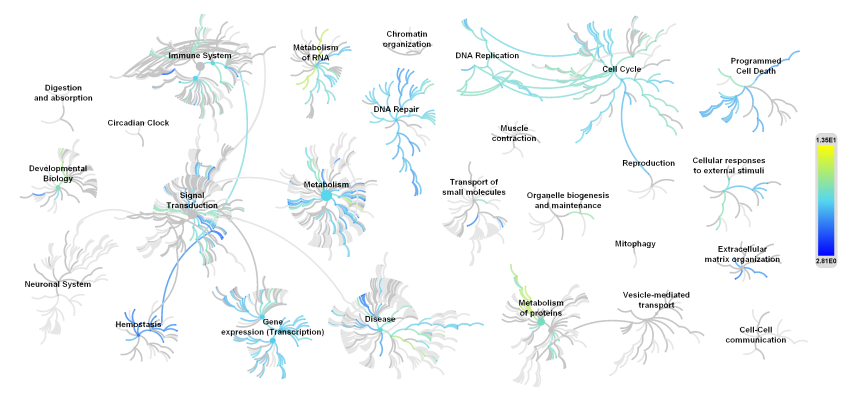
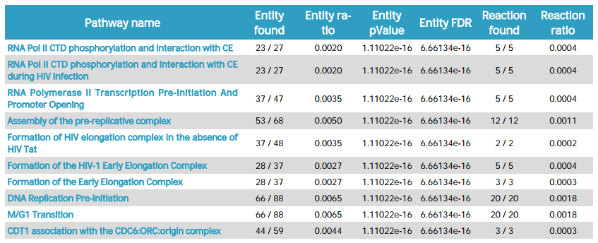
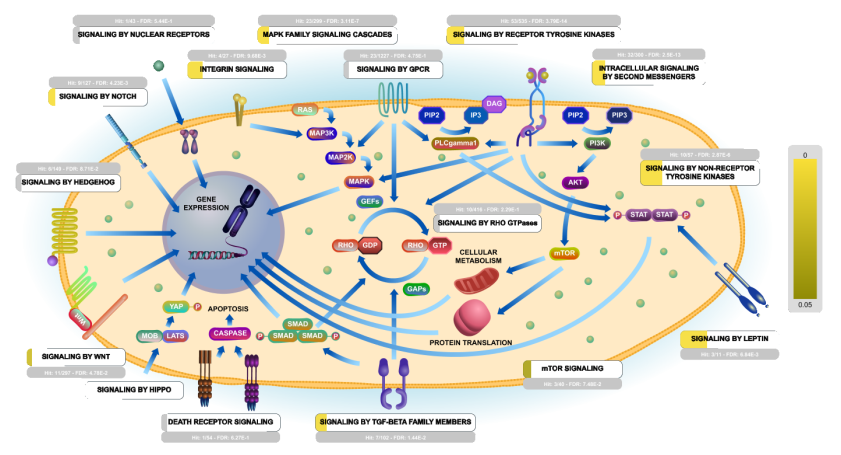
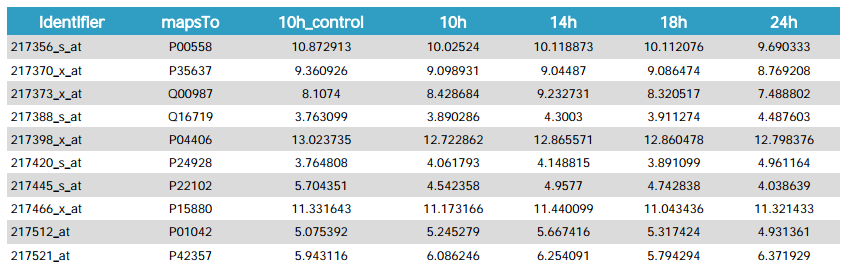
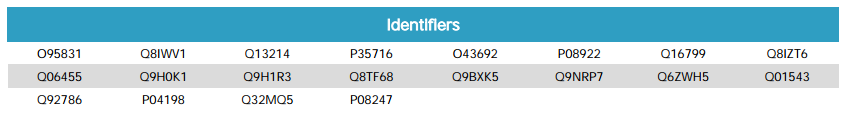

Analysis Exporter
---
AnalysisExporter is a tool to export the analysis result to a PDF document (PDF-1.7). Click here to know more about [Analysis Service](https://reactome.org/dev/analysis).
 
### Structure of the PDF

* __Administrative:__   a brief explanation of what you are going to see
* __Content:__  table of navigation list
* __Introduction:__ explanation of [Reactome](https://reactome.org) database and latest publications
* __Summary of Parameters and Results:__    parameters used in analysis service and a genome-wide overview image:      
    

* __Top over-representation pathways sorted by p-Value:__   table contains the top pathways sorted by p-value with each statistics data  
    
    
* __Pathway details:__  detailed information for each pathway as listed afore and table of list identifiers found in that pathway  
    
    
* __Summary of identifiers found:__ all identifiers found in this analysis   
    
    
* __Summary of identifiers not found:__ all identifiers not found in this analysis　   
    
    

###Usage
* Pre-requirements  
    * Maven 3.+ 
    * Java 8 
    * [Neo4j](https://neo4j.com/)
* Install
```git
git clone https://bitbucket.org/fabregatantonio/analysis-report
cd analysis-report
mvn clean package
```

Since this module will retrieve Reactome Pathway data from the [Reactome Graph Database](https://reactome.org/dev/graph-database), You should install that in your local environment, if you don't have that yet or never experience on that, we strongly recommend you have a look on it.
To [configure reactome database](https://github.com/reactome/graph-core) and provide properties programmatically, we use `GraphCoreConfig` extends `Neo4jConfig` inside this module like:
 
```java
@org.springframework.context.annotation.Configuration
@ComponentScan(basePackages = {"org.reactome.server.graph"})
@EnableTransactionManagement
@EnableNeo4jRepositories(basePackages = {"org.reactome.server.graph.repository"})
@EnableSpringConfigured
public class GraphCoreConfig extends Neo4jConfig {
    private SessionFactory sessionFactory;
    private Logger logger = LoggerFactory.getLogger(GraphCoreConfig.class);

    @Bean
    public Configuration getConfiguration() {
        Configuration config = new Configuration();
        config.driverConfiguration()
                .setDriverClassName("org.neo4j.ogm.drivers.http.driver.HttpDriver")
                .setURI("http://".concat(System.getProperty("neo4j.host")).concat(":").concat(System.getProperty("neo4j.port")))
                .setCredentials(System.getProperty("neo4j.user"), System.getProperty("neo4j.password"));
        return config;
    }

    @Override
    @Bean
    public SessionFactory getSessionFactory() {
        if (sessionFactory == null) {
            logger.info("Creating a Neo4j SessionFactory");
            sessionFactory = new SessionFactory(getConfiguration(), "org.reactome.server.graph.domain");
        }
        return sessionFactory;
    }
}
```

So you need to initialise the graph-core before every thing like: 

```
    public static void initialise(String host, String port, String user, String password){
            System.setProperty("neo4j.host", host);
            System.setProperty("neo4j.port", port);
            System.setProperty("neo4j.user", user);
            System.setProperty("neo4j.password", password);
    }
```

Add AnalysisExporter as Maven dependency in your project: 

```
    <dependency>
        <groupId>org.reactome.server.tools</groupId>
        <artifactId>analysis-exporter</artifactId>
        <version>1.0.0-SNAPSHOT</version>
    </dependency>
    
    <!-- EBI repo -->
    <repository>
        <id>pst-release</id>
        <name>EBI Nexus Repository</name>
        <url>http://www.ebi.ac.uk/Tools/maven/repos/content/repositories/pst-release</url>
    </repository>
```

Use AnalysisExporter to export DPF document: 

```
    // This path must contains the layout and graph json files (eg: R-HSA-12345.json and R-HSA-12345.graph.json).
    // You can download them from https://reactome.org/download/current/diagram/
    String DIAGRAM_PATH = "diagram/path";
    
    // This path must contains the EHLD svg file
    // You can download them from https://reactome.org/download/current/ehld/
    String EHLD_PATH = "ehld/path";
    
    // This path contains ths svgSummary file.
    // You will also find a file containing a list of available EHLD: https://reactome.org/download/current/ehld/svgsummary.txt
    String svgSummary = "directory/svgSummary.txt";

    // This path contains the fireworks layout json files. 
    // You can download the file from https://reactome.org/download/current/fireworks/
    String FIREWORKS_PATH = "fireworks/path";
    
    // This path contains the Reactome analysis binary files (eg: res_301812345_1.bin).
    String ANALYSIS_PATH = "analysis/path";
    
    ReportArgs reportArgs = new ReportArgs("MjAxODAyMTIxMTI5MzdfMQ==", DIAGRAM_PATH, EHLD_PATH, FIREWORKS_PATH, ANALYSIS_PATH, svgSummary);
    
    // Save the PDF document to the local directory.
    FileOutputStream fos = new FileOutputStream(new File("directory/fileName.pdf"));
    AnalysisExporter.export(reportArgs, fos);
    
    // Or hold the PDF Document as a OutputStream so you can pass it by any http method.
    OutputStream os = new ByteArrayOutputStream();
    AnalysisExporter.export(reportArgs, os);
    ...
```

###License
This module use the [iText](https://itextpdf.com) library to create PDF document, so it naturally adopt the [](https://opensource.org/licenses/AGPL-3.0), 
you can use this module freely on condition that also comply with this license.
